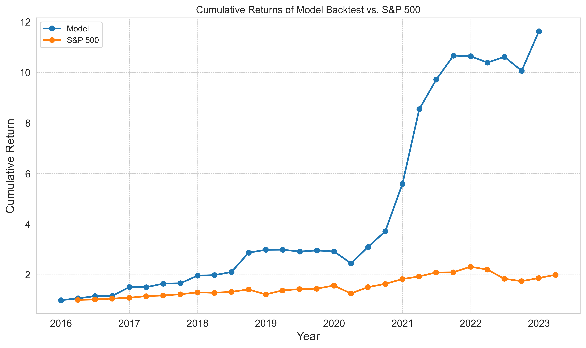

# Master’s Capstone Project: Data-Driven Portfolio Construction: Financial Services Stock Selection

## Table of Contents
- [🎯 Project Overview](#-project-overview)
- [💡 The Problem & My Approach](#-the problem--my-approach)

## 🎯 Project Overview
Growing up in the New York City metropolitan area, I've always been fascinated by Wall Street's dynamic interplay of market forces and corporate strategy. As an investor, even the smallest stake connects you to a company's journey—its boardroom decisions, its operational pivots, and the market's reaction. During my undergraduate studies in Economics, I deepened my appreciation for microeconomic theory and business dynamics. Now, as a data scientist, I'm applying that foundation to ask: Which companies are truly healthy, and which ones are financially unstable?

### 🎖️ Master's Capstone Achievement

- 38.52% Annual Returns with sophisticated risk management
- Sharpe Ratio: 1.19 (institutional-quality performance)
- 90.8% Success Rate at avoiding poor-performing stocks
- Statistical Significance: p = 0.023 (robust outperformance)

## 💡 The Problem & My Approach
Most quantitative investment strategies lean heavily on price trends and technical indicators—an approach that often overlooks the fundamentals driving long‑term value. In this capstone project, I take a different tack: I merge 25 years of quarterly financial statements with market data to identify "unhealthy" stocks likely to underperform.

### 🧠 Investment Philosophy

> **"Given the high stakes in finance, I prioritize recall on unfavorable outcomes"**

My custom loss function ensures:
- **90.8% accuracy** at avoiding bad investments
- **Conservative selection** with only 10.2% buy signals
- **47.6% precision** when model does recommend a stock

Sincere appreciation to the developers and maintainers of these valuable resources.